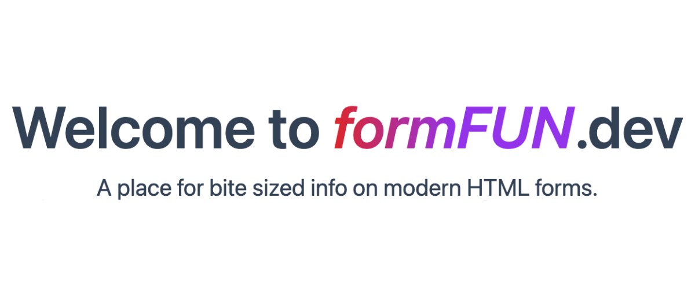

# formFUN.dev

This is the source code for the formFUN.dev website. It is built using [Astro](https://astro.build), [Tailwind CSS](https://tailwindcss.com/), and [SolidJS](https://www.solidjs.com/).

This tool was created as a demo for my Netlify Compose 2024 talk, Why HTML Forms Still Rule the Web

## 🤝 Contributing

If you're interested in contributing to the project, please read the [Contributing Guidelines](CONTRIBUTING.md).

## 🚀 Quick start for local development

1. Run `npm install` to install dependencies.
2. Run `npm run dev` to start the local development server.
3. Open [http://localhost:4321](http://localhost:4321) in your browser.

## 🧞 Commands

All commands are run from the root of the project, from a terminal:

| Command                   | Action                                           |
| :------------------------ | :----------------------------------------------- |
| `npm install`             | Installs dependencies                            |
| `npm run dev`             | Starts local dev server at `localhost:4321`      |
| `npm run build`           | Build your production site to `./dist/`          |
| `npm run preview`         | Preview your build locally, before deploying     |
| `npm run astro ...`       | Run CLI commands like `astro add`, `astro check` |
| `npm run astro -- --help` | Get help using the Astro CLI                     |

## 👀 Want to learn about the tech in this project?

Feel free to check out the documentation for each technology used:

- [Astro documentation](https://docs.astro.build) | [Astro Discord](https://astro.build/chat)
- [Tailwind CSS documentation](https://tailwindcss.com/docs) | [Tailwind Community](https://v1.tailwindcss.com/community)
- [SolidJS documentation](https://docs.solidjs.com) | [SolidJS Discord](https://discord.gg/UjkdspBF)

Join these communities to connect with other developers and get help!
